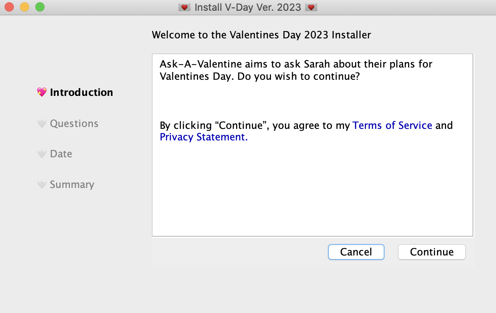
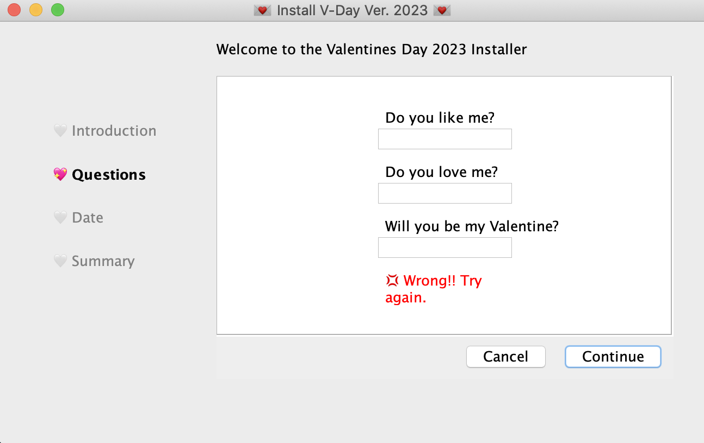
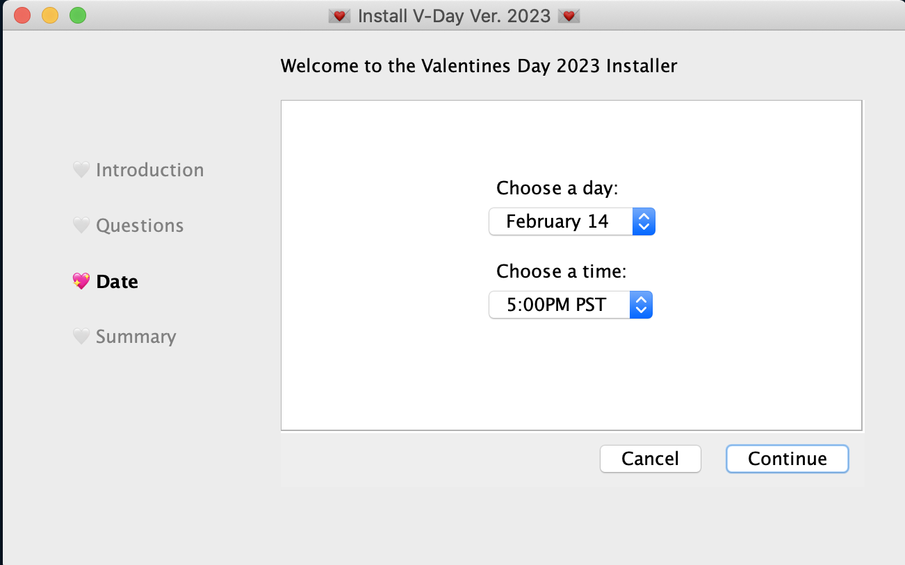
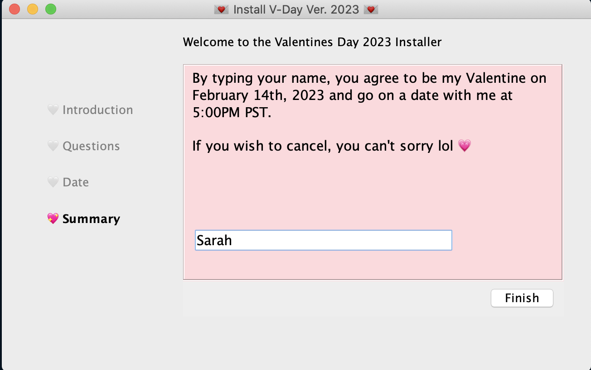
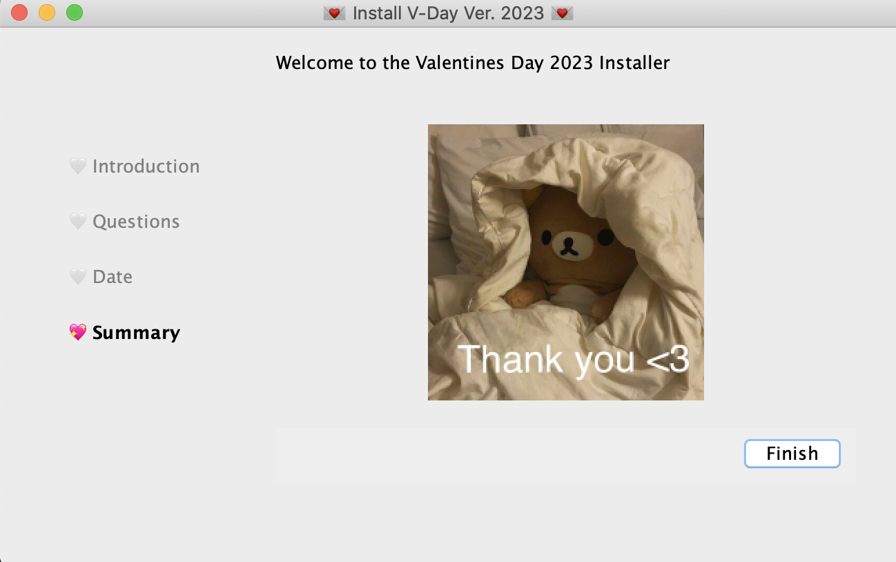

# Ask-A-Valentine Program 💖
Having trouble asking your special someone to be your valentine? Ask them with this simple program! The user is taken through a series of questions in hopes of asking them to be the programmer's valentine. The user has the option to exit at any time. 

# How To Use
After running Main, the program will ask for your valentine's name. This name will be used within
the program. Save to jar file then send to them!

# What I Used
Java, specifically the Java Swing library.

# Demo Screenshots
### Introduction

### Questions

### Date

### Summary

### End Reward 

